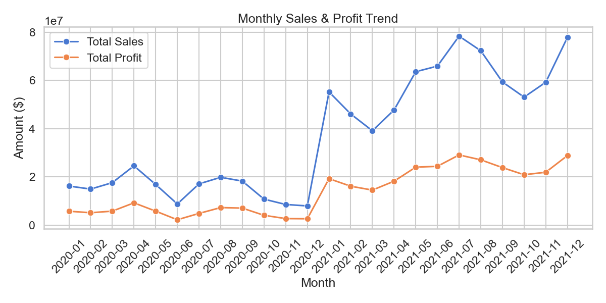
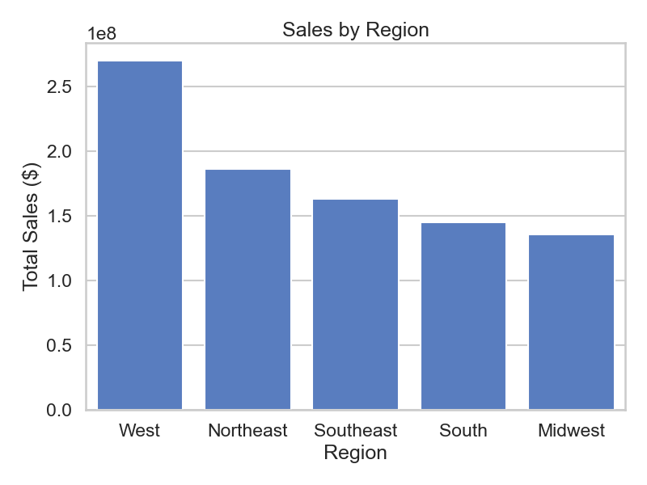
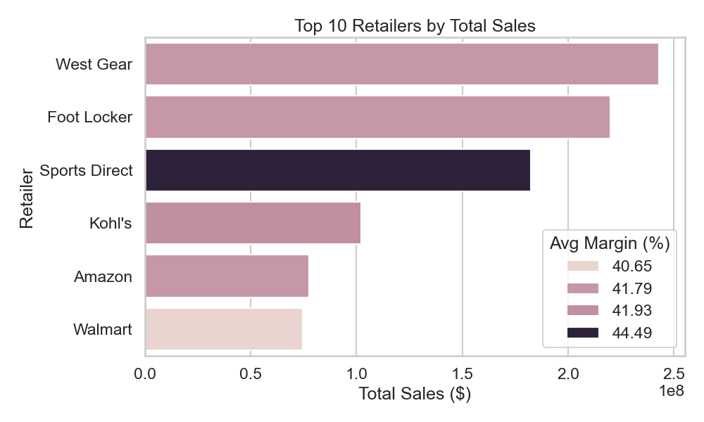
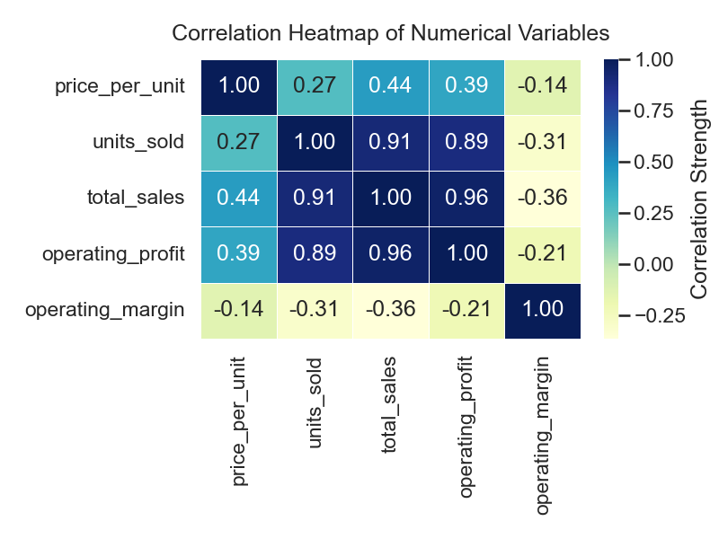

# Adidas U.S. Sales Performance Business Report (2020–2021)

**Author:** Justin Wang  
**Program:** Data Science & Society, Tilburg University  
**Project:** End-to-End ETL + SQL Analytics + Python Visualization + Dashboard

---

# Table of Contents
1. [Executive Summary](#executive-summary)  
2. [Dataset & Methodology](#dataset--methodology)  
3. [Key Performance Indicators (KPIs)](#key-performance-indicators-kpis)  
4. [Insight 1: 2021 Post-Pandemic Rebound](#insight-1-2021-post-pandemic-rebound)  
5. [Insight 2: West Region Dominance](#insight-2-west-region-dominance)  
6. [Insight 3: High Retailer Concentration](#insight-3-high-retailer-concentration)  
7. [Insight 4: Volume-Driven Revenue Model](#insight-4-volume-driven-revenue-model)  
8. [Strategic Recommendations](#strategic-recommendations)  
9. [Risks & Mitigation](#risks--mitigation)  
10. [Appendix](#appendix)

---

# Executive Summary

This report evaluates Adidas' U.S. sales performance between **2020 and 2021**, drawing on a complete ETL pipeline, SQL-based dimensional modeling, advanced analytics, and visual dashboards.

Key insights include:

- **Strong revenue inflection in 2021**, indicating post-pandemic recovery  
- **High regional concentration**, with the West region significantly outperforming others  
- **Retailer-driven revenue**, dominated by West Gear, Foot Locker, and Sports Direct  
- **Sales heavily volume-driven**, with limited pricing elasticity  

These trends highlight key strategic opportunities in retailer partnerships, regional expansion, and inventory planning.

---

# Dataset & Methodology

## ETL Process
- Cleaned raw CSV files by removing repeated headers and standardizing formats  
- Converted price, sales, and profit fields into numeric values  
- Exported clean data into SQLite database

## Data Modeling
Dimensional model created using SQL:

- `dim_city`
- `dim_retailer`
- `dim_product`
- `fact_sales`

## Analytical SQL
Performed KPI queries, regional breakdown, monthly trends, retailer comparison, and correlation analyses.

## Visualization
All plots generated using Seaborn + Matplotlib and saved under:

```
reports/figures/
```

Example figures used in this report:

- Correlation heatmap  
- Monthly sales & profit trends  
- Sales by region  
- Top retailers by revenue  

---

# Key Performance Indicators (KPIs)

| Metric | Value | Interpretation |
|-------|--------|----------------|
| **Total Revenue** | High (hundreds of millions USD) | Strong multi-region market penetration |
| **Total Profit** | Positive and rising | Growth tied closely to revenue |
| **Avg Operating Margin** | ~40% | Competitive margin structure |
| **Retailers** | 50+ | Wide distribution network |
| **Regions** | 5 | Balanced geographic spread |
| **Time Span** | 2020–2021 | Covers pre + post pandemic |

---

# Insight 1: 2021 Post-Pandemic Rebound

The monthly trend chart below shows dramatic growth beginning in **January 2021**, with sales and profit increasing sharply and maintaining high levels through late 2021.

### Monthly Sales & Profit Trend  


### Interpretation
- Pandemic recovery boosted retail activity  
- Supply chain stabilization improved product availability  
- Adidas regained momentum through strategic product launches

### Impact
- Early-year inventory allocation should be increased  
- Marketing budgets should emphasize Q1–Q2 campaigns  

---

# Insight 2: West Region Dominance

Regional sales analysis shows that:

- **West Region** leads all others by a significant margin  
- Northeast and Southeast follow but remain far behind  

### Regional Sales Chart  


### Interpretation
- Strong retail presence in urban West Coast markets  
- Higher demand for premium products  
- Lifestyle and fashion trends aligned with Adidas’ brand image

### Business Impact
- Invest more heavily in inventory and partnerships in the West  
- Develop region-specific campaigns targeting major cities  

---

# Insight 3: High Retailer Concentration

Top retailers generate a disproportionate share of total sales:

### Top Retailers by Total Sales  


### Key Patterns
- West Gear, Foot Locker, and Sports Direct dominate  
- These retailers also enjoy **higher average margins**  
- Amazon and Walmart contribute less than expected despite scale

### Strategic Importance
- Exclusive partnerships and co-marketing can yield high returns  
- Risk of retailer over-dependence must be monitored  

---

# Insight 4: Volume-Driven Revenue Model

Correlation analysis indicates:

### Correlation Heatmap  


### Key Findings
- **Units Sold ↔ Total Sales** correlation = **0.91**  
- **Total Sales ↔ Profit** correlation = **0.96**  
- Weak correlation between **price per unit and sales volume**  

### Interpretation
- Adidas relies on volume, not price increases, to drive revenue  
- Pricing elasticity is limited  
- Inventory distribution and retailer network matter more than pricing strategy  

---

# Strategic Recommendations

## 1. Reinforce West Region Strategy
- Increase stock availability  
- Accelerate store expansion  
- Launch targeted campaigns during peak seasons  

## 2. Deepen Partnerships with Top Retailers
- Offer exclusive SKUs  
- Create joint marketing initiatives  
- Improve wholesale conditions for top partners  

## 3. Reduce Retailer Concentration Risk
- Strengthen presence in Amazon/Walmart  
- Encourage wider SKU adoption across smaller retailers  

## 4. Leverage Volume-Driven Dynamics
- Focus on fast-moving product lines  
- Improve forecasting and replenishment systems  
- Expand distribution in high-demand cities  

---

# Risks & Mitigation

| Risk | Impact | Mitigation |
|------|--------|------------|
| Retailer concentration | High dependency on few retailers | Diversify into e-commerce & smaller partners |
| Margin volatility | Regional shifts | Optimize regional price/margin structure |
| Supply chain instability | Stockouts, lost revenue | Use predictive forecasting & safety stock |
| Weak pricing elasticity | Limits price control | Emphasize volume-based growth |

---

# Appendix

### A. ETL Scripts
- Python cleaning script (`clean_csv.py`)
- SQL transformation (`data_cleaning.sql`)

### B. Analytical SQL
- Full query set resides in `sql_queries.sql`

### C. Figures
- All images stored under `reports/figures/`

---

# End of Report
